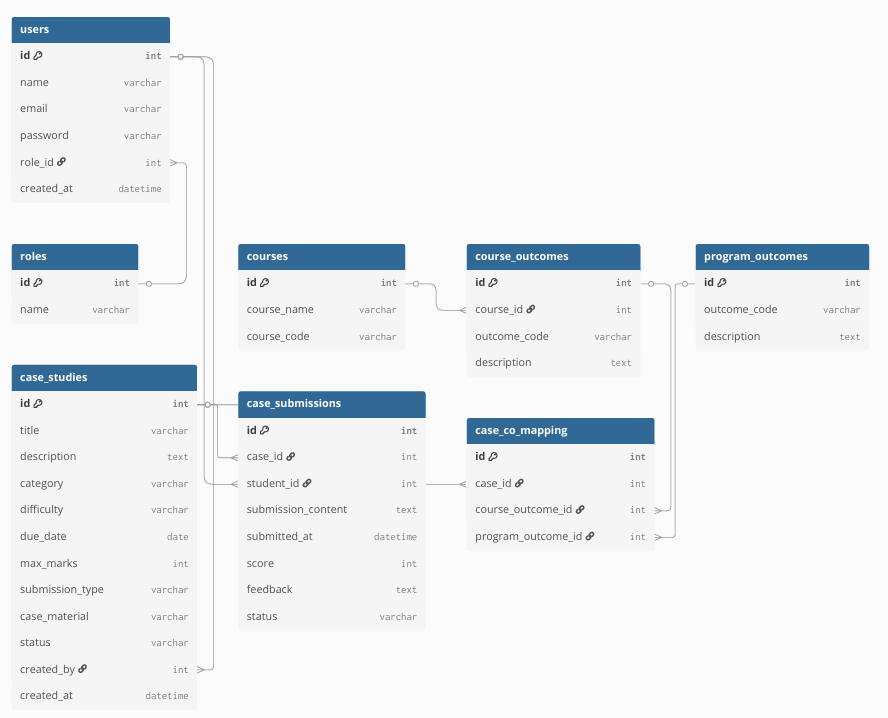

# Industry Case Study Repository

A full-stack academic platform designed to manage industry case studies where faculty create cases, students submit solutions, and administrators manage the platform.

The system enables structured learning through real-world case studies with secure authentication, role-based access control, and evaluation workflows.

---

# Tech Stack

## Backend
- Spring Boot
- Spring Security
- JWT Authentication
- JPA / Hibernate
- MySQL

## Frontend
- React
- Tailwind CSS
- Axios
- React Query
- Context API
- React Router

---

# System Roles

### Admin
- Manage users
- Publish case studies
- Monitor platform activity and analytics

### Faculty
- Create case studies
- Review student submissions
- Evaluate solutions with scores and feedback

### Student
- Browse available case studies
- Submit solutions
- Track submission status and evaluation feedback

---

# Core Implemented Features

- JWT Authentication and Role-Based Access Control
- Case Study Creation and Management
- Student Solution Submission System
- Faculty Evaluation Workflow
- Role-Based Dashboards (Admin / Faculty / Student)
- Case Study Analytics Dashboard
- Full-Stack CRUD Operations
- Secure REST API Communication

---

# Backend Architecture

The backend follows a layered architecture to ensure modularity and maintainability.

### Controller Layer
Handles HTTP requests and API endpoints.

### Service Layer
Contains business logic and workflow implementation.

### Repository Layer
Handles database interaction using Spring Data JPA.

### Additional Components
- DTO Pattern for secure data transfer
- Global Exception Handling
- JWT Security Filters
- API Response Wrappers
- Spring Cache for analytics optimization

---

# Project Structure
industry-case-study-repository  
│  
├── backend  
│ ├── controller  
│ ├── service  
│ │ └── impl  
│ ├── repository  
│ ├── entity  
│ ├── dto  
│ ├── security  
│ └── config  
│  
├── frontend  
│ ├── components  
│ ├── pages  
│ ├── services  
│ ├── context  
│ └── utils  
│  
└── database  
└── mysql-schema  

---

# Database Design

The system uses a relational schema with the following entities:

- Users
- Roles
- Case Studies
- Case Submissions
- Courses
- Course Outcomes
- Program Outcomes
- Case CO Mapping

### Key Relationships

- Roles → Users
- Faculty → Case Studies
- Students → Case Submissions
- Case Studies → Case Submissions
- Courses → Course Outcomes
- Case Studies → CO & PO Mapping

ER Diagram:

---

# API Architecture

The platform exposes RESTful APIs for all core operations.

### Authentication

POST /auth/login

### Case Studies

GET /cases  
POST /cases  
PUT /cases/{id}  
DELETE /cases/{id}  

### Student Submissions

GET /student/submissions  
POST /student/submissions

### Faculty Review

GET /faculty/submissions  
PUT /submissions/{id}/evaluate

All protected APIs require a JWT token in the Authorization header.

---

# Security Implementation

- JWT-based stateless authentication
- Role-based authorization (Admin, Faculty, Student)
- BCrypt password encryption
- Spring Security filter chain
- Protected REST endpoints
- Token validation for every request

Example Authorization Header:

Authorization: Bearer <JWT_TOKEN>

---

# Frontend State Management

The frontend manages application state using:

- React Hooks (useState, useEffect, useContext)
- React Query for API data fetching and caching
- Axios for API communication
- Context API for authentication and theme management

Benefits:

- Efficient server-state caching
- Reduced API calls
- Consistent UI data updates
- Improved performance

---

# Error Handling

### Backend
- Global Exception Handler
- Structured HTTP error responses
- Input validation for API requests

### Frontend
- Axios error handling
- Loading and error states in UI
- Toast notifications for feedback

---

# Future Enhancements

- Discussion system for case collaboration
- Notification system for submission updates
- Advanced analytics dashboards
- AI-based case recommendation system

---